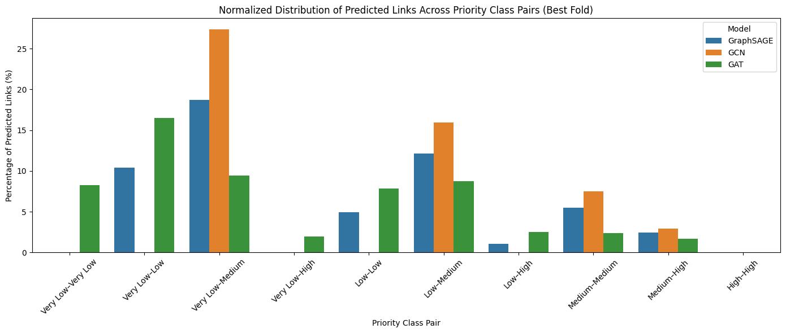

# 🔗 GNN-based Link Prediction of Vaccine Candidate Proteins

This project explores Graph Neural Networks (GNNs) for predicting novel protein-protein interactions (PPIs) using features from vaccine candidate analysis. We analyze whether these predicted links tend to connect proteins of similar or different priority classes (e.g., High–High vs. High–Low), especially among **isolated proteins** with no known STRING interactions.

---

## 🧬 STRING Network Visualization

Below is the STRING-based protein-protein interaction network built using the top 2000 protein sequences submitted to the STRING API:


> **Note:** This image represents known interactions only. New links predicted using GNNs are analyzed separately.

---
## 📁 Repository Structure
```
│
├── Data/
│   │── top_2000_sequences.faa # Input protein sequences
│   ├── string_interactions.tsv # Known STRING PPI network
│   ├── string_mapping.tsv # Mapping from STRING IDs to FASTA IDs
│   └── complete_vaccine_analysis_all_3257_proteins.csv # Feature + priority annotations
├── Code/
│   ├── link_prediction_experiment.ipynb # Main Jupyter notebook
│
├── Results/
│ ├──GraphSAGE/
│ │ ├── embeddings_fold1.pt / best.pt # Saved embeddings per fold
│ │ ├── priority_link_table_best.csv # Priority class pair table
│ │ └── heatmap_best_SAGE.png # Heatmap (best fold)
│ ├── GCN/
│ │ └── ...
│ ├── GAT/
│ │ └── ...
│ └── result.png # Combined bar chart comparison
└── README.md       
```
## 📊 Objective

To investigate the nature of **newly predicted links** between proteins, particularly:

- Do **isolated proteins** (those without known STRING edges) form connections?
- Are the new links **homogeneous** (e.g., High–High) or **heterogeneous** (e.g., High–Low)?
- What insights can be drawn from priority-class pairing patterns in predictions?
- Reveal trends specific to different GNN architectures (GraphSAGE, GCN, GAT).

---

## ⚙️ Workflow Summary

1. **Data Loading & Graph Construction**
   - Load FASTA sequences and STRING PPI data.
   - Build a NetworkX graph, then relabel nodes to FASTA IDs.
   - Add protein features and priority labels from Biomni vaccine analysis.

2. **GNN Link Prediction Models**
   - Implement and train: `GraphSAGE`, `GCN`, `GAT`.
   - Use 3-fold cross-validation and grid search for hyperparameter tuning.
   - Evaluate each fold using ROC-AUC and save best model checkpoint.

3. **Predicted Link Scoring & Filtering**
   - Score isolated-to-connected and isolated-to-isolated links.
   - Select top 1000 high-confidence edges (sigmoid ≥ 0.90).

4. **Class-Pair Analysis**
   - Assign predicted links to pairs of priority classes.
   - Build a symmetric table of class–class link counts.
   - Visualize using **heatmaps** and **normalized bar charts** for comparison.

---

## 📈 Key Findings

- GNN models differ in predicted link **diversity**:
  - **GCN**: Strongly biased toward `Very Low–Medium` and `Low–Medium`.
  - **GraphSAGE**: Most balanced and diverse predictions.
  - **GAT**: Moderate class-mixing, avoids High-priority links.
  
- High-priority proteins tend to be **under-linked** — possibly due to fewer examples or embedding sparsity.

- **Combined normalized bar chart** helps compare GNN tendencies across all class-pair interactions.

---

## 📈 Visualization Sample

**Combined Normalized Bar Chart (Best Fold – All Models)**  
Each bar shows the % of predicted links per class pair:



---

## 🛠 Dependencies

- Python 3.8+
- PyTorch
- PyTorch Geometric
- NetworkX
- Biopython
- Pandas
- Seaborn / Matplotlib
- scikit-learn

---

## 📚 Acknowledgments

- STRING Database for interaction data.
- Biomni Toolkit for feature extraction and priority scoring.
- Developed as part of a research project on vaccine candidate network inference.

---

## 📬 Contact

For questions or collaborations, please contact:
**Muhammad Kazim** – *Graduate Research Assistant*  
CELL Lab  
Muhammad.kazim@ndsu.edu

