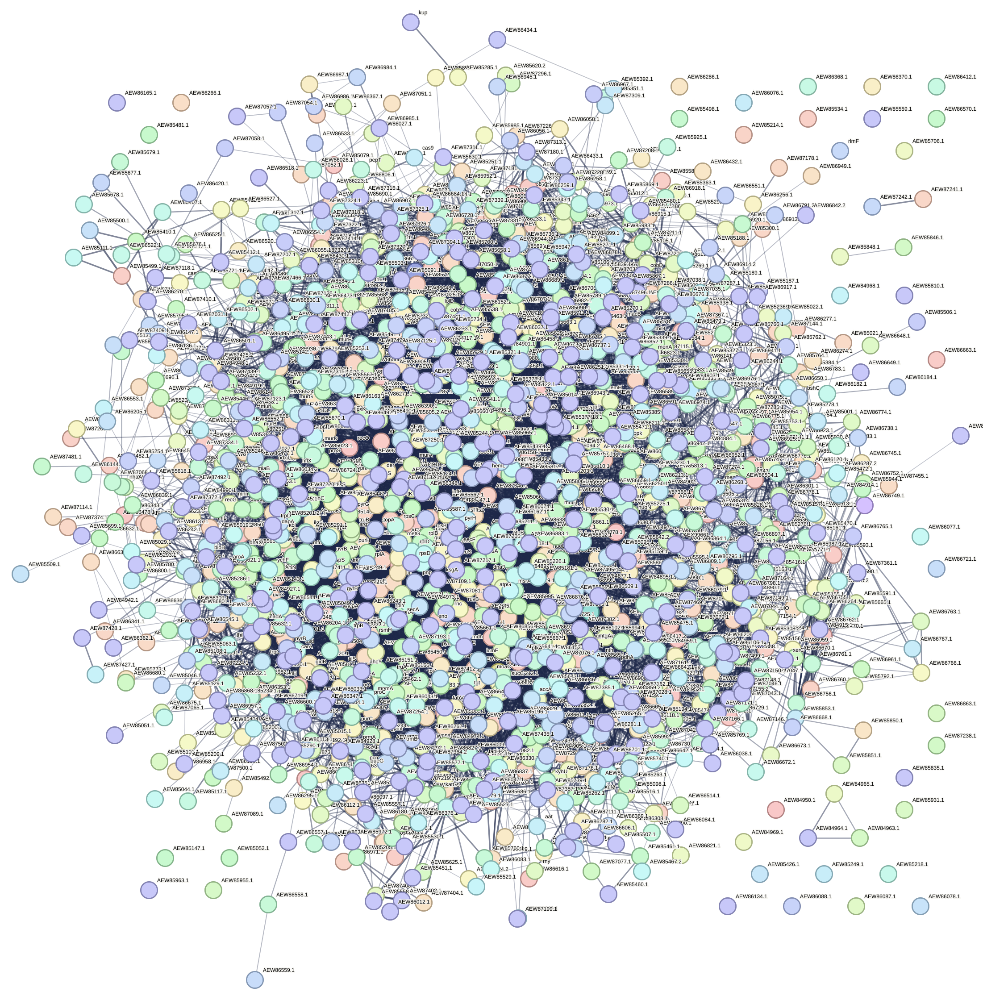

## Multimodal GNN-based Link Prediction for Vaccine Candidate Discovery
This repository implements a multimodal graph learning framework that integrates:

Biomni vaccine-priority and immunological features

ESM-2 protein language model embeddings

Node2Vec structural graph embeddings

STRING protein–protein interaction (PPI) networks

to predict novel protein–protein interactions in Flavobacterium using Graph Neural Networks (GNNs).
The workflow supports priority-aware link prediction, enabling the identification of underexplored high-priority vaccine candidates.

---

## 🧬 STRING Network Visualization

Below is the original STRING PPI network obtained from the organism proteome and mapped to FASTA identifiers:



> **Note:** This network only captures known interactions.
The GNN models infer new, high-confidence PPIs, especially for isolated and poorly understood proteins..

---
## 📁 Repository Structure
```
│
├── Data/
│   ├── flavobacterium_proteome.faa
│   ├── string_interactions.tsv
│   ├── string_mapping.tsv
│   ├── complete_vaccine_analysis_all_3257_proteins.csv
│   ├── esm2_embeddings.h5
│   ├── node2vec_flavobacterium.npz
│   └── ...
│
├── Code/
│   ├── link_prediction_experiment.ipynb
│   ├── esm_embedding_generation.ipynb
│   ├── node2vec_training.ipynb
│   └── utils/
│
├── Results/
│   ├── Ablations/
│   │   ├── esm_only_results.json
│   │   ├── n2v_only_results.json
│   │   └── biomni_n2v_results.json
│   ├── GraphSAGE/
│   │   ├── best_model.pt
│   │   ├── embeddings.pt
│   │   ├── priority_link_table.csv
│   │   └── heatmap_testAUC.png
│   ├── FinalFigures/
│   │   ├── Figure_2_ROC_PR_Curves.png
│   │   ├── Figure_3_Bar_Comparison.png
│   │   ├── Figure_4_Priority_Link_Heatmap.png
│   │   ├── Figure_6_Predicted_Network.png
│   │   └── PCA_of_GNN_Embeddings.png
│   └── ...
│
└── README.md
```
## 📊 Objective

This project investigates whether multimodal GNNs can recover missing PPIs and prioritize vaccine-relevant proteins by integrating:

Biological evidence (Biomni)

Evolutionary sequence context (ESM-2)

Graph structure (Node2Vec)

We specifically analyze:

Interactions involving isolated proteins

Whether predicted links are homogeneous (High–High) or heterogeneous (High–Low)

How each GNN architecture behaves under multimodal input

Priority-class mixing patterns in predicted edges

---

## ⚙️ Workflow Summary

**Step 1 — Data Integration**

i- STRING PPIs + FASTA mapping

ii- Biomni features (antigenicity, localization, virulence)

iii- ESM-2 embeddings (480-D)

iv- Node2Vec embeddings (128-D)

Multimodal feature matrix construction

**Step 2 — GNN Models** 

We train and evaluate:

i- GCN

ii- GAT

iii- GraphSAGE (**best model**)


**Under three regimes:**

1- Biomni-only

2- Biomni + ESM-2

3- Biomni + ESM-2 + Node2Vec

Plus ablation experiments to test independent feature performance.

**Step 3 — Link Prediction**

Score all candidate edges

Filter high-confidence predictions (≥ 0.90)

Focus on isolated–connected and isolated–isolated links

**Step 4 — Priority-Aware Class Pairing**

Build a 4×4 class-pair matrix

Visualize using heatmaps & barplots

Interpret class mixing and high-priority involvement
---

## 📈 Key Findings

GraphSAGE is the most effective GNN

   * Achieved best test AUC = 0.750 (Biomni-only)

   * Higher-dimensional features (ESM-2 + Node2Vec) did not improve generalization

   * Biomni provides the most stable inductive signal in low-homophily graphs

**Ablation results reveal high latent predictive capacity**

   i- Node2Vec-only AUC: 0.963

   ii- ESM-2-only AUC: 0.941

These represent upper bounds on the informativeness of each modality.

**Priority-aware insights**

High–Medium and High–Low edges appear more frequently than High–High

Many isolated proteins gain high-confidence predicted links

## Predicted Network Visualization

High-confidence predicted interactions (≥ 0.90) using GraphSAGE + Biomni:


---
Node color legend:

Red — High-priority proteins

Orange — Medium-priority proteins

Blue — Low-priority proteins

Grey — Very Low priority proteins

This network illustrates cross-tier connectivity and the emergence of medium/high-priority hubs.
## 🛠 Dependencies

- Python 3.8+
- PyTorch
- PyTorch Geometric
- NetworkX
- Biopython
- Pandas
- Seaborn / Matplotlib
- scikit-learn

---

## 📚 Acknowledgments

- [STRING DB](https://string-db.org/) – PPI data source  
- [Biomni Toolkit](https://github.com/snap-stanford/biomni) – Feature generation & priority scoring  
- Developed as part of the **CELL Lab** research initiative at NDSU.


---

## 📬 Contact

For questions or collaborations, please contact:
**Muhammad Kazim** – *Graduate Research Assistant*  
CELL Lab  
Muhammad.kazim@ndsu.edu

